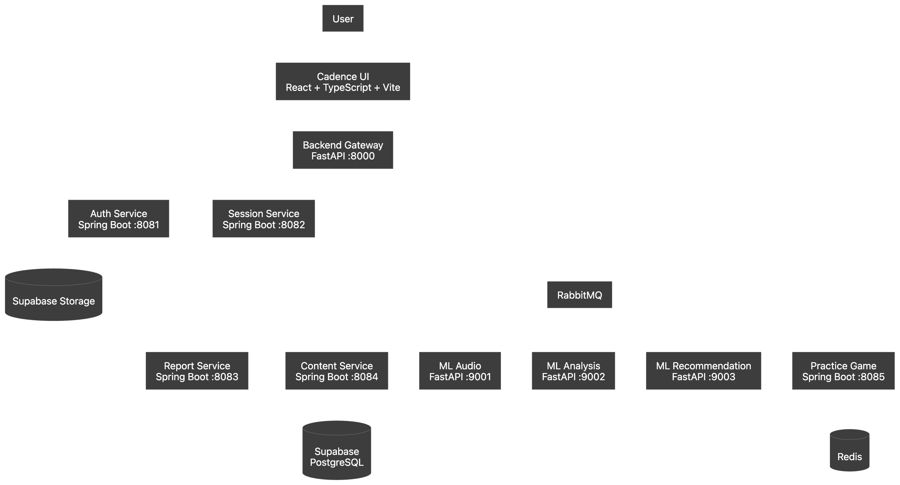

# 🎙️ Cadence

### AI-Powered Speech Assessment & Adaptive Communication Coaching

Cadence is an AI-powered speech assessment and coaching platform that analyzes how you speak, identifies communication weaknesses, generates actionable feedback, and adapts practice exercises around your individual needs.

Instead of treating speech improvement as a collection of generic exercises, Cadence creates a continuous learning loop:

**Speak → Analyze → Understand → Practice → Improve**

---

## ✨ Overview

Cadence combines speech recognition, deterministic speech analysis, AI-powered diagnostics, personalized recommendations, and gamified practice into one platform.

A typical assessment starts with a user recording their speech. Cadence processes the recording through a distributed pipeline, transcribes it using Whisper, extracts measurable speech characteristics, evaluates the performance, generates qualitative AI feedback, and produces an AMCAT-style assessment report.

The resulting assessment is then used to build a **personalized speech profile**, which drives targeted exercises and practice sessions.

### The Cadence Learning Loop

```text
                 ┌──────────────┐
                 │    SPEAK     │
                 └──────┬───────┘
                        ↓
                 ┌──────────────┐
                 │   ANALYZE    │
                 └──────┬───────┘
                        ↓
                 ┌──────────────┐
                 │   DIAGNOSE   │
                 └──────┬───────┘
                        ↓
                 ┌──────────────┐
                 │   PRACTICE   │
                 └──────┬───────┘
                        ↓
                 ┌──────────────┐
                 │   IMPROVE    │
                 └──────┬───────┘
                        │
                        └──────────→ Speak Again
```

---

## 🚀 Key Features

### 🎤 AI Speech Assessment

- Browser-based speech recording
- Automatic audio/video processing
- Whisper-powered transcription
- Word-level timestamps
- Speech-rate analysis
- Pause and fluency analysis
- Filler-word detection
- Stutter detection
- Reading-mode transcript alignment
- WER-based evaluation

### 🧠 AI-Powered Diagnostics

Cadence combines deterministic analysis with LLM-powered qualitative feedback to identify areas such as:

- Pronunciation
- Fluency
- Grammar
- Vocabulary
- Clarity
- Confidence
- Mother Tongue Influence (MTI)

### 📊 Detailed Assessment Reports

Each assessment can produce an AMCAT-style report containing:

- Overall score
- CEFR level
- Speech metrics
- Pronunciation analysis
- Fluency analysis
- Intonation analysis
- Clarity analysis
- MTI analysis
- Transcript comparison
- Error identification
- AI-generated insights

### 🎯 Adaptive Learning

Assessment results are converted into a persistent speech profile.

Cadence then:

1. identifies the user's weakest areas,
2. prioritizes those weaknesses,
3. selects relevant exercises,
4. generates personalized drills when required,
5. tracks exercise performance,
6. updates the user's learning profile.

### 🎮 Speech Practice Games

Cadence turns targeted exercises into interactive speaking drills.

The practice system supports:

- speech recording
- real-time evaluation
- Whisper transcription
- target-text comparison
- WER-based scoring
- practice attempts
- session progress
- success/failure states

### 📚 Intelligent Reading Content

Cadence includes an adaptive content system with:

- curated speech word banks
- topic-specific passages
- difficulty levels
- pre-generated passage pools
- target-word verification
- personalized daily tips
- AI-generated fallback content

---

# 🏗️ Architecture

Cadence uses a **distributed, polyglot microservice architecture**.

The platform combines React on the frontend, FastAPI and Spring Boot services on the backend, dedicated Python ML services, PostgreSQL/Supabase for persistence, RabbitMQ for asynchronous processing, Redis for transient state, and WebSockets for real-time updates.

### High-Level Architecture



# 🔧 Technology Stack

| Layer | Technology |
|---|---|
| Frontend | React, TypeScript, Vite |
| UI | Chakra UI |
| Animations | Framer Motion |
| State Machines | XState |
| API Gateway | Python, FastAPI |
| Core Backend | Java, Spring Boot |
| ML Services | Python, FastAPI |
| Speech Recognition | Whisper |
| LLM Providers | Groq, Gemini |
| Database | PostgreSQL / Supabase |
| Storage | Supabase Storage |
| Authentication | Supabase Auth / service authentication |
| Messaging | RabbitMQ |
| Cache | Redis |
| Real-Time Communication | WebSockets / STOMP |
| PDF Generation | `@react-pdf/renderer` |
| Containerization | Docker / Docker Compose |

---

# 🧩 Microservices

Cadence is split into specialized services so that speech processing, application logic, persistence, and learning systems can evolve independently.

| Service | Port | Responsibility |
|---|---:|---|
| `cadence-ui` | `5173` | React web application |
| `backend-gateway` | `8000` | API gateway and orchestration |
| `auth-service` | `8081` | Authentication and identity boundary |
| `session-service` | `8082` | Assessment lifecycle and uploads |
| `report-service` | `8083` | Report persistence and real-time notifications |
| `content-service` | `8084` | Passages, word banks and daily tips |
| `practice-game-service` | `8085` | Practice sessions and speech drills |
| `ml-audio` | `9001` | Whisper transcription and audio analysis |
| `ml-analysis` | `9002` | Scoring, alignment and AI diagnostics |
| `ml-recommendation` | `9003` | Speech profiles and recommendations |

---

# 🎤 Assessment Pipeline

The assessment pipeline is the core workflow of Cadence.

> **[IMAGE PLACEHOLDER — Assessment pipeline diagram]**
>
> `docs/images/assessment-pipeline.png`

```text
User
 │
 ▼
Record Speech
 │
 ▼
Upload Assessment
 │
 ▼
Session Service
 │
 ▼
RabbitMQ
 │
 ▼
ML Audio
 │
 ├── Whisper Transcription
 ├── Word Timestamps
 ├── Pause Analysis
 └── Stutter Detection
 │
 ▼
ML Analysis
 │
 ├── Deterministic Scoring
 ├── Transcript Alignment
 ├── WER Analysis
 └── AI Diagnostics
 │
 ▼
Report Service
 │
 ├── Persist Report
 └── WebSocket Notification
 │
 ▼
Assessment Results
 │
 ▼
Recommendation Service
 │
 ├── Speech Profile
 └── Personalized Exercises
```

---

# 🔄 Assessment Flow

### 1. Assessment Initiation

The frontend checks the user's assessment eligibility and requests a new assessment session.

The Session Service creates the session and returns a `sessionId`.

### 2. Content Selection

Cadence provides an assessment package containing elements such as:

- topic prompt
- reading passage
- target words

Content can be selected from the pre-generated passage pool.

### 3. Speech Recording

The browser uses the MediaRecorder API to capture the user's speech.

The recording interface handles:

- microphone/camera permissions
- countdown
- recording
- automatic stop
- audio/video chunk collection
- upload

### 4. Upload

The Session Service validates the uploaded media and stores the recording in Supabase Storage.

### 5. Asynchronous Processing

An `analysis.requested` event starts the ML processing pipeline.

### 6. Speech Analysis

ML Audio performs transcription and low-level speech analysis.

### 7. Assessment Analysis

ML Analysis combines deterministic metrics with AI diagnostics.

### 8. Report Generation

The Report Service persists the result and notifies the frontend through WebSockets.

### 9. Recommendations

The same assessment result is used to generate or update the user's personalized speech profile and recommended exercises.

---

# 🧠 ML Audio Service

**Port:** `9001`

The ML Audio service handles the first stage of speech intelligence.

Its primary responsibilities are:

- audio loading
- audio normalization
- Whisper transcription
- word-level timestamps
- speech-rate analysis
- pause analysis
- stutter detection

Whisper is loaded once during service startup and kept in memory for subsequent requests.

### Stutter Detection

Cadence currently identifies patterns such as:

- repetitions
- prolongations
- blocks

The service also extracts pause-related metrics that are passed downstream to the analysis layer.

---

# 📊 ML Analysis Service

**Port:** `9002`

ML Analysis is responsible for converting raw transcription and speech metrics into an assessment.

It follows a two-layer approach:

```text
                Assessment Input
                       │
            ┌──────────┴──────────┐
            ▼                     ▼
    Deterministic Analysis    AI Diagnostics
            │                     │
            │                     │
            └──────────┬──────────┘
                       ▼
                Final Analysis
```

### Deterministic Layer

Used for measurable metrics such as:

- speech rate
- fillers
- stutters
- lexical characteristics
- transcript alignment
- WER
- foundational scoring

### AI Diagnostic Layer

Used for qualitative analysis and coaching feedback.

This can provide observations around:

- pronunciation
- grammar
- fluency
- clarity
- vocabulary
- MTI
- communication quality

This separation ensures that the LLM provides interpretation and coaching rather than being the sole source of numerical scoring.

---

# 📖 Reading Assessment & WER

For reading assessments, Cadence compares the user's spoken transcript with the expected passage.

```text
Reference Passage
        │
        ▼
   User Speech
        │
        ▼
    Whisper
        │
        ▼
   Transcription
        │
        ▼
 Transcript Alignment
        │
        ▼
 ┌──────┼─────────┐
 ▼      ▼         ▼
Insert Delete  Substitute
```

The alignment pipeline can identify:

- substitutions
- deletions
- insertions

and calculate Word Error Rate (WER).

---

# 📋 Assessment Reports

Cadence produces detailed reports designed to make speech performance understandable rather than simply presenting a single number.

> **[IMAGE PLACEHOLDER — Assessment report screenshot]**
>
> `docs/images/assessment-report.png`

Reports include:

### Overall Performance

- Overall score
- CEFR level
- high-level performance summary

### Speech Dimensions

- Pronunciation
- Fluency
- Intonation
- Clarity
- MTI

### Detailed Feedback

- transcription
- detected errors
- qualitative insights
- MTI observations
- improvement areas

### PDF Export

Assessment reports can also be exported as A4 PDFs directly from the frontend.

---

# 🎯 Adaptive Learning

One of Cadence's core differentiators is that the assessment does not end with the report.

The result feeds directly into an adaptive learning system.

```text
Assessment Result
       │
       ▼
Speech Profile
       │
       ▼
Weakness Ranking
       │
       ▼
Exercise Recommendations
       │
       ▼
Practice
       │
       ▼
Performance
       │
       ▼
Updated Profile
```

The system tracks areas including:

- Fluency
- Confidence
- Grammar
- Pronunciation
- Vocabulary
- Clarity

The lowest-performing areas receive higher priority when selecting exercises.

---

# 🏋️ Practice & Speech Games

**Port:** `8085`

The Practice Game Service provides short-form speech exercises based on the user's recommendations.

A typical drill follows:

```text
Select Exercise
      ↓
Record Speech
      ↓
Upload Audio
      ↓
Whisper Transcription
      ↓
Compare With Target
      ↓
Calculate WER
      ↓
Success / Retry
```

Practice state is managed using a combination of:

- PostgreSQL for durable data
- Redis for active session state
- XState for frontend game states

The current practice evaluation uses a WER threshold of approximately **0.15** for matching target speech.

---

# 📚 Content System

Cadence uses a **Passage Pool** architecture to avoid generating every assessment passage synchronously.

```text
                    Word Bank
                       │
                       ▼
                 LLM Generation
                       │
                       ▼
              Target Word Verification
                       │
                       ▼
              Generated Passages
                       │
                       ▼
                Passage Pool
                       │
                       ▼
                  Assessment
```

Passages are categorized by:

- topic
- difficulty
- target words
- speech issue
- word-bank compatibility

The system verifies that required target words actually appear in generated content before storing it.

---

# 📝 Content Service

**Port:** `8084`

The Content Service provides:

- reading passages
- passage selection
- daily tips
- content quality evaluation

Passage retrieval follows a pool-first strategy:

```text
Request
   ↓
Resolve Topic & Difficulty
   ↓
Check Passage Pool
   ├── Found → Return
   │
   └── Empty → Generate Fallback
```

A background refill process keeps the pool populated so that normal user requests can be served quickly.

---

# 💡 Personalized Daily Tips

Cadence supports tier-aware daily coaching.

Free users can receive deterministic daily content, while higher tiers can receive personalized tips based on recent assessment weaknesses.

The personalized flow is:

```text
Recent Assessments
       ↓
Weak Areas
       ↓
LLM
       ↓
Personalized Tip
```

---

# 📨 Event-Driven Architecture

RabbitMQ is used for long-running and asynchronous workflows.

The major assessment events are:

```text
analysis.requested
        ↓
analysis.audio.completed
        ↓
analysis.completed
        ↓
recommendations.updated
```

This architecture keeps the user-facing request path lightweight while allowing AI processing to happen independently.

---

# ⚡ Real-Time Updates

Cadence uses STOMP over WebSockets to communicate processing updates back to the frontend.

The frontend subscribes to an assessment-specific topic and can receive events such as:

```text
REPORT_READY
RECOMMENDATIONS_READY
ASSESSMENT_FAILED
```

This allows the processing screen to update without polling the backend continuously.

---

# 🗄️ Data & Storage

Cadence uses Supabase/PostgreSQL as the primary persistent data layer.

Major data domains include:

```text
Assessment Sessions
Reports
Generated Passages
Passage Pool
Word Bank
Speech Profiles
Exercise Recommendations
Practice Sessions
Drill Attempts
Content Quality Scores
```

Supabase Storage is used for assessment recordings.

Redis is used primarily for temporary practice-session state.

---

# 🐳 Local Infrastructure

The project includes Docker-based local infrastructure.

```text
PostgreSQL 16
RabbitMQ 3.13.7
Redis 7
pgAdmin
```

Infrastructure configuration is available under:

```text
infrastructure/
└── docker-compose.yml
```

Database initialization is handled through:

```text
infrastructure/postgres/init.sql
```

---

# 📁 Project Structure

```text
Cadence/
│
├── src/                         # React frontend
│   ├── components/
│   ├── services/
│   └── ...
│
├── backend/                     # FastAPI gateway / Python backend
│   ├── main.py
│   ├── services/
│   ├── utils/
│   └── scripts/
│
├── services/
│   ├── auth-service/
│   ├── session-service/
│   ├── report-service/
│   ├── content-service/
│   ├── practice-game-service/
│   ├── ml-audio/
│   ├── ml-analysis/
│   └── ml-recommendation/
│
├── infrastructure/
│   ├── docker-compose.yml
│   └── postgres/
│
├── database/
│
├── package.json
│
└── README.md
```

---

# 🛠️ Getting Started

## Prerequisites

Make sure you have the following installed:

- Node.js
- npm
- Python
- Java / JDK
- Maven
- Docker
- Docker Compose
- Git

You will also need:

- a Supabase project
- required Supabase credentials
- configured LLM provider credentials

---

## Clone the Repository

```bash
git clone <YOUR_REPOSITORY_URL>
cd Cadence
```

---

## Configure Environment Variables

Create the backend environment file:

```bash
cp backend/.env.example backend/.env
```

Configure the required values for:

- Supabase
- LLM providers
- RabbitMQ
- ML services
- application configuration

Spring Boot services use:

```text
services/.env.local
```

for local development configuration.

> **Never commit API keys, Supabase service-role keys, or other secrets to Git.**

---

# ▶️ Running Cadence

The recommended development command is:

```bash
npm run dev:all
```

This starts the local infrastructure and development services together.

### Frontend

```bash
npm run dev
```

Runs the React application on:

```text
http://localhost:5173
```

### ML Audio

```bash
npm run dev:ml-audio
```

### ML Analysis

```bash
npm run dev:ml-analysis
```

### ML Recommendation

```bash
npm run dev:ml-recommendation
```

Individual Spring Boot services can be started using:

```bash
mvn spring-boot:run
```

from their respective service directories.

---

# 🧪 Testing

Cadence includes utilities for validating different parts of the platform.

Examples include:

```text
verify_session_service_sanity.py
smoke_test_practice_game_service.py
pipeline_e2e_test.py
rollback_negative_test.py
```

The project also supports evaluation of the speech pipeline using ground-truth transcripts.

Evaluation can include:

- Word Error Rate
- word-bank coverage
- processing latency
- stage-level pipeline performance

---

# 🔐 Security

Cadence uses a gateway-oriented authentication model.

The external request flow is generally:

```text
Client
  ↓
Gateway / Authentication Boundary
  ↓
Internal Services
```

The Java services use a passthrough authentication pattern for trusted internal requests.

For production deployments, internal services should be appropriately isolated and protected so that identity information cannot be spoofed by untrusted external clients.

---

# ⚙️ Engineering Principles

Cadence follows several important architectural principles.

### Deterministic metrics remain deterministic

Numerical scoring should be reproducible and should not depend on an LLM arbitrarily changing a score.

### AI provides interpretation

LLMs are primarily used where qualitative reasoning adds value.

### Long-running work is asynchronous

Speech processing and recommendation generation are decoupled through RabbitMQ.

### Durable state and transient state are separated

PostgreSQL stores durable application data while Redis handles short-lived interactive state.

### Content is generated ahead of time where possible

The Passage Pool minimizes user-facing LLM latency.

### Services have clear responsibilities

Speech processing, analysis, recommendations, reporting, content and practice are isolated into dedicated services.

---

# 🧭 Current Architecture vs. Legacy Components

Cadence has evolved from an earlier monolithic architecture into the current distributed system.

Some older Python content-generation components remain useful as historical/reference implementations, while the newer **Content Service + Passage Pool** architecture handles the primary content-serving workflow.

Similarly, legacy assessment persistence is still supported during the migration toward the newer assessment-session model.

These components should not be assumed to represent the preferred architecture for new development.

---

# 🚧 Current Limitations

Cadence is an actively evolving platform.

Some areas are still under development, including:

- production-grade assessment eligibility enforcement
- recovery of stuck assessment sessions
- advanced phonetic pronunciation analysis
- more robust MTI/accent detection
- expanded speech diagnostics
- broader exercise coverage
- production-scale observability
- automated recovery of dead-lettered events
- stronger service-to-service authentication
- comprehensive load testing

The current speech-scoring system also contains heuristic/proxy measurements for certain dimensions. These should be treated as product-level indicators rather than clinically or linguistically validated measurements.

---

# 🔮 Future Direction

The long-term goal is to make Cadence a continuously adapting communication coach rather than a one-time speech assessment tool.

Future development can extend the platform toward:

- richer phoneme-level pronunciation analysis
- advanced accent and MTI modeling
- deeper progress analytics
- personalized learning paths
- real-time speaking feedback
- larger exercise libraries
- more intelligent difficulty adaptation
- production-grade distributed observability
- large-scale assessment infrastructure

---

# 🤝 Contributing

Contributions are welcome.

When contributing, please keep service boundaries intact and avoid placing business logic into unrelated services.

Before submitting changes:

1. Test the affected service independently.
2. Verify API contracts.
3. Check RabbitMQ event compatibility where applicable.
4. Verify frontend/backend data mappings.
5. Ensure environment secrets are not committed.
6. Run relevant smoke or integration tests.

---

# 👨‍💻 Development

Cadence is built as a modular platform, so developers can work independently on:

```text
Frontend
   │
   ├── Assessment UI
   ├── Reports
   ├── Dashboard
   └── Practice Games

Backend
   │
   ├── Gateway
   ├── Session
   ├── Reports
   └── Content

AI / ML
   │
   ├── Audio
   ├── Analysis
   └── Recommendations
```

This separation allows individual services to be developed, tested, and scaled without tightly coupling the entire platform.

---

# 📌 Project Status

Cadence is currently under active development.

The core platform architecture is already composed of:

- React frontend
- FastAPI gateway
- Spring Boot microservices
- Python ML services
- Whisper speech recognition
- LLM-powered diagnostics
- Supabase/PostgreSQL
- RabbitMQ
- Redis
- WebSocket-based updates
- Adaptive recommendations
- Speech practice games

The system is continuously evolving toward a production-ready adaptive speech-coaching platform.

---

# 📸 Product Preview

### Dashboard

> **[IMAGE PLACEHOLDER]**
>
> Upload your dashboard screenshot here.

### Speech Assessment

> **[IMAGE PLACEHOLDER]**
>
> Upload your assessment/recording screen here.

### Assessment Report

> **[IMAGE PLACEHOLDER]**
>
> Upload your assessment report screenshot here.

### Adaptive Exercises

> **[IMAGE PLACEHOLDER]**
>
> Upload your exercises/practice screenshot here.

### Speech Game

> **[IMAGE PLACEHOLDER]**
>
> Upload your speech-game screenshot here.

---

# 🌐 Project Links

- **Repository:** Add GitHub repository URL
- **Live Application:** Add deployment URL
- **Documentation:** Add documentation URL
- **Demo:** Add demo/video URL

---

# 📄 License

Add the repository's actual license here if a `LICENSE` file is present.

---

## Built With

**React · TypeScript · Vite · Chakra UI · Framer Motion · FastAPI · Spring Boot · Python · Whisper · Groq · Gemini · PostgreSQL · Supabase · RabbitMQ · Redis · WebSockets**

---

### Cadence

> **Don't just speak. Understand how you speak, practice what matters, and improve continuously.**
